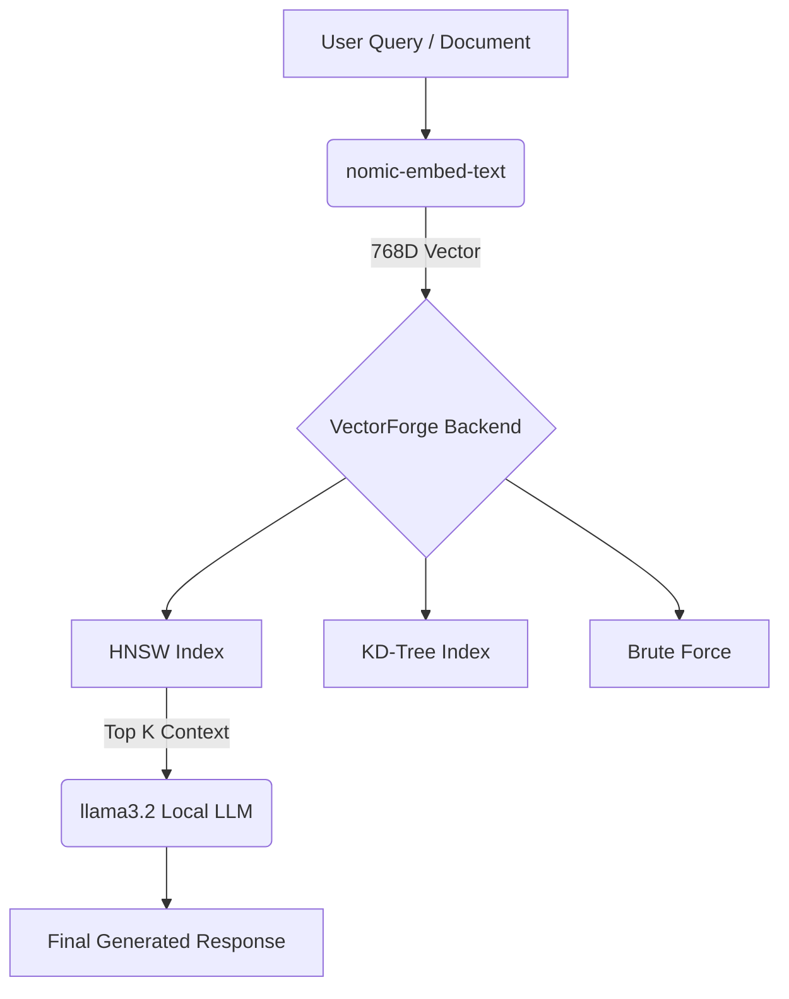

# VectorForge 🚀

VectorForge is a high-performance Vector Database and Retrieval-Augmented Generation (RAG) pipeline built entirely from scratch in C++. 

It implements production-grade vector search algorithms natively and interfaces seamlessly with local LLMs (via Ollama) to embed, index, and query unstructured text data.

## Features

- **Custom HNSW Implementation:** Written from scratch in C++, featuring a multi-layer navigable small world graph for $O(\log N)$ approximate nearest neighbor search.
- **Algorithm Comparison Engine:** Includes Brute Force $O(N \cdot d)$ and KD-Tree implementations to benchmark against HNSW in real-time.
- **Multiple Distance Metrics:** Supports Cosine Similarity, Euclidean Distance (L2), and Manhattan Distance (L1).
- **RAG Pipeline:** Seamlessly integrates with local `llama3.2` and `nomic-embed-text` models.
- **Interactive UI:** Built-in web server serving a dashboard with a live 2D PCA projection of the 16D/768D semantic vector space.

---

## Architecture Overview



VectorForge runs as a standalone C++ binary. It uses `cpp-httplib` to expose a REST API, allowing the frontend client to query the database and insert document chunks seamlessly.

---

## Setup & Installation

### Requirements
- **C++17 Compiler:** (e.g., `g++` via MSYS2 on Windows)
- **Ollama:** Running locally to serve the embedding and generation models.

### 1. Start Ollama
Ensure you have pulled the necessary models for the RAG pipeline:
```bash
ollama pull nomic-embed-text
ollama pull llama3.2
ollama serve
```

### 2. Compile the Server
Clone the repository and compile the backend:
```bash
g++ -std=c++17 -O2 main.cpp -o db -lws2_32
```
*(Note for Linux/Mac users: drop the `-lws2_32` flag and link `-lpthread` if necessary)*

### 3. Run VectorForge
```bash
./db
```
The server will initialize the HTTP server and host the frontend dashboard at `http://localhost:8080`.

---

## API Reference

VectorForge exposes a RESTful API for integration into other applications.

### Search & Operations
| Method | Endpoint | Description |
|---|---|---|
| `GET` | `/search?v=...&k=5&metric=cosine&algo=hnsw` | K-NN search |
| `POST` | `/insert` | Insert a vector into the DB |
| `GET` | `/benchmark` | Run latency tests across all algorithms |
| `GET` | `/hnsw-info` | Retrieve internal graph structure and layer stats |

### RAG & Documents
| Method | Endpoint | Description |
|---|---|---|
| `POST` | `/doc/insert` | Embed text chunk and index into HNSW |
| `POST` | `/doc/ask` | Retrieve top chunks and generate LLM answer |

---

## Technical Deep Dive: Why HNSW?
While KD-Trees work well for low-dimensional data (e.g., spatial coordinates), they suffer from the *curse of dimensionality* when dealing with 768-dimensional semantic embeddings. VectorForge solves this by using **Hierarchical Navigable Small World (HNSW)** graphs. 

By inserting vectors into a probabilistic multi-layer graph, the search algorithm can take long-range "highway" steps at the top layers to quickly locate the correct semantic neighborhood, before dropping to denser lower layers to perform a precise beam search for the exact nearest neighbors.

---
## License
MIT License
